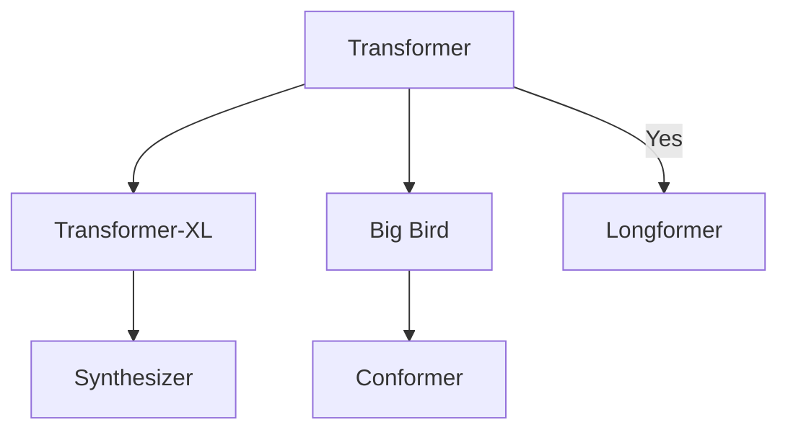

The Transformer model is the evolution of the encoder-decoder architecture, proposed in the paper [Attention is All You Need](https://arxiv.org/abs/1706.03762). While encoder-decoder architecture has been relying on recurrent neural networks (RNNs) to extract sequential information, the Transformer doesn’t use RNN. Transformer based models have primarily replaced LSTM, and it has been proved to be superior in quality for many sequence-to-sequence problems.

<!--more-->


|---
| | Site | Video | Code
|-|:-:|:-:|:-:
| Transformer[^vaswani2017attention] | [`Google`{:.info}](https://ai.googleblog.com/2017/08/transformer-novel-neural-network.html) | [`Yannic`{:.info}](https://www.youtube.com/watch?v=iDulhoQ2pro) | 
| Longformer[^beltagy2020longformer] | | [`Yannic`{:.info}](https://www.youtube.com/watch?v=_8KNb5iqblE) |
| Big Bird[^zaheer2020big] | | [`Yannic`{:.info}](https://www.youtube.com/watch?v=WVPE62Gk3EM) |
| Linear[^katharopoulos2020transformers] | [`Official`{:.info}](https://linear-transformers.com/) | [`Official`{:.info}](https://www.youtube.com/watch?v=KBWh7XCUAi8) [`Yannic`{:.info}](https://www.youtube.com/watch?v=hAooAOFRsYc) | [`Official`{:.info}](https://github.com/idiap/fast-transformers) [`lucidrains`{:.info}](https://github.com/lucidrains/linear-attention-transformer)
| Linformer[^wang2020linformer] | | [`Yannic`{:.info}](https://www.youtube.com/watch?v=-_2AF9Lhweo) | [`lucidrains`{:.info}](https://github.com/lucidrains/linformer)
| Synthesizer[^tay2020synthesizer] | | [`Yannic`{:.info}](https://www.youtube.com/watch?v=q7QP_lfqnQM) |
| Performers[^choromanski2020rethinking] | [`Google`{:.info}](https://ai.googleblog.com/2020/10/rethinking-attention-with-performers.html) | [`Yannic`{:.info}](https://www.youtube.com/watch?v=xJrKIPwVwGM) | [`Google`{:.info}](https://github.com/google-research/google-research/tree/master/performer) [`lucidrains`{:.info}](https://github.com/lucidrains/performer-pytorch)
| Reformer[^kitaev2020reformer] | [`Google`{:.info}](https://ai.googleblog.com/2020/01/reformer-efficient-transformer.html) | [`Yannic`{:.info}](https://www.youtube.com/watch?v=i4H0kjxrias) | [`lucidrains`{:.info}](https://github.com/lucidrains/reformer-pytorch)
| Sinkhorn[^tay2020sparse] | | | [`lucidrains`{:.info}](https://github.com/lucidrains/sinkhorn-transformer)
| Conformer[^gulati2020conformer] | | | [`lucidrains`{:.info}](https://github.com/lucidrains/conformer)
| Transformer-XL[^dai2019transformer] | | | [`lucidrains`{:.info}](https://github.com/lucidrains/memory-transformer-xl)
| Compressive[^rae2019compressive] | [`DeepMind`{:.info}](https://deepmind.com/blog/article/A_new_model_and_dataset_for_long-range_memory) | | [`lucidrains`{:.info}](https://github.com/lucidrains/compressive-transformer-pytorch)
| Fast Transformers with Clustering[^vyas2020fast] | [`Official`{:.info}](https://clustered-transformers.github.io/) |  | [`Official`{:.info}](https://github.com/idiap/fast-transformers)




image:

DETR: End-to-End Object Detection with Transformers (Paper Explained)
https://www.youtube.com/watch?v=T35ba_VXkMY

An Image is Worth 16x16 Words: Transformers for Image Recognition at Scale (Paper Explained)
https://www.youtube.com/watch?v=TrdevFK_am4

We start with a brief recap of the vanilla self-attention introduced in Attention is all you need[^vaswani2017attention].

For any seqeunce of length $N$, given the  *queries* denoted by $Q \in \mathbb{R}^{N \times D_k}$ and *keys* denoted by $K \in \mathbb{R}^{N \times D_k}$,  we define the standard dot product attention matrix $A \in \mathbb{R}^{N \times N}$ as:


$$
A = \mathcal{softmax} \left( {\frac{Q K^T}{\sqrt{D_k}}} \right)
$$
    

Using the attention weights $A$ and the values $V \in \mathbb{R}^{N \times
D_v}$, we compute the new values $\hat{V}$ as follows:

$$
\hat{V} = A V.
$$

Computing attention matrix $A$ requires $\mathcal{O}({N^2 D_k})$ operations and the new values $\hat{V}$ requires $\mathcal{O}({N^2 D_v})$ operations. This results in an asymptotic complexity of $\mathcal{O}({N^2 \max \left(D_k, D_v\right)})$.


```
@article{caruana1997multitask,
  title={Multitask learning},
  author={Caruana, Rich},
  journal={Machine learning},
  volume={28},
  number={1},
  pages={41--75},
  year={1997},
  publisher={Springer}
}
```

[^beltagy2020longformer]: Beltagy, Iz, Matthew E. Peters, and Arman Cohan. "Longformer: The long-document transformer." arXiv preprint arXiv:2004.05150 (2020).
[^zaheer2020big]: Zaheer, Manzil, et al. "Big bird: Transformers for longer sequences." Advances in Neural Information Processing Systems 33 (2020).
[^katharopoulos2020transformers]: Katharopoulos, Angelos, et al. "Transformers are rnns: Fast autoregressive transformers with linear attention." International Conference on Machine Learning. PMLR, 2020.
[^wang2020linformer]: Wang, Sinong, et al. "Linformer: Self-Attention with Linear Complexity." arXiv preprint arXiv:2006.04768 (2020).
[^beltagy2020longformer]: Beltagy, Iz, Matthew E. Peters, and Arman Cohan. "Longformer: The long-document transformer." arXiv preprint arXiv:2004.05150 (2020).
[^tay2020synthesizer]: Tay, Yi, et al. "Synthesizer: Rethinking Self-Attention in Transformer Models." arXiv preprint arXiv:2005.00743 (2020).
[^choromanski2020rethinking]: Choromanski, Krzysztof, et al. "Rethinking attention with performers." arXiv preprint arXiv:2009.14794 (2020).
[^kitaev2020reformer]: Kitaev, Nikita, Łukasz Kaiser, and Anselm Levskaya. "Reformer: The efficient transformer." arXiv preprint arXiv:2001.04451 (2020).
[^vaswani2017attention]: Vaswani, Ashish, et al. "Attention is all you need." Advances in neural information processing systems 30 (2017): 5998-6008.
[^tay2020sparse]: Tay, Yi, et al. "Sparse Sinkhorn Attention." arXiv preprint arXiv:2002.11296 (2020).
[^gulati2020conformer]: Gulati, Anmol, et al. "Conformer: Convolution-augmented Transformer for Speech Recognition." arXiv preprint arXiv:2005.08100 (2020).
[^dai2019transformer]: Dai, Zihang, et al. "Transformer-xl: Attentive language models beyond a fixed-length context." arXiv preprint arXiv:1901.02860 (2019).
[^rae2019compressive]: Rae, Jack W., et al. "Compressive transformers for long-range sequence modelling." arXiv preprint arXiv:1911.05507 (2019).
[^vyas2020fast]: Vyas, Apoorv, Angelos Katharopoulos, and François Fleuret. "Fast transformers with clustered attention." Advances in Neural Information Processing Systems 33 (2020).